<p align="center">
  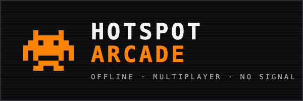
</p>

# Hotspot Arcade

[](https://github.com/tarikbc/hotspot-arcade/actions/workflows/build.yml)
[](https://github.com/tarikbc/hotspot-arcade/releases/latest)
[](LICENSE)

**Offline multiplayer party games hosted from a Flipper Zero + ESP32-S2 WiFi board.**
No internet, no app install. You host an open WiFi network from the Flipper; people
nearby join it, a captive page hands them into a game in their phone browser, and
everyone plays together over the local network. Built for dead zones: buses, planes,
subways, campsites, anywhere with no signal.

The Flipper is the **game master**: it shows the lobby and live scoreboard and drives
the rounds. The ESP32 board is the **referee**: it runs the WiFi access point, serves
the game to phones, and keeps the real-time game state. See
[docs/ARCHITECTURE.md](docs/ARCHITECTURE.md).

Ten games, all phone-driven. Pick your emoji avatar on the way in and fire off emoji
reactions that float up on everyone's screen mid-game.

**Whole-group** (scale to everyone in the room, ready-up lobby, shared live leaderboard):

- **Trivia** — Kahoot-style and fully self-organizing. Players ready up and vote a topic
  in the lobby; an all-ready 5-second countdown starts it; phones buzz in A/B/C/D with
  points for correct and fast; a collapsible leaderboard rides along and a podium ends
  it. Topics are the trivia packs on the SD card.
- **Would You Rather** — a live A/B poll; tap your pick, watch the split reveal.
- **Word Scramble** — unscramble the word and type it first; fastest correct scores most.
- **Reaction Duel** — fastest finger: wait for green, tap first to win, false-start and
  you're out for the round.

**1v1 duels** (challenge a player, many matches at once, rematch button, wins score on
the Flipper leaderboard):

- **Connect Four**, **Tic-Tac-Toe**, **Dots & Boxes**, **Reversi/Othello**.
- **Pong** — real-time rally with on-screen paddles.

**Cooperative-ish:**

- **Drawing & guessing** — one player draws on their phone canvas, everyone else guesses
  in a chat; points for the drawer and the first correct guess; rounds rotate the drawer.

All games run on one pluggable engine on the ESP (the real-time referee), and the web
client shares one implementation of the lobby, countdown, timer, leaderboard, and podium,
so adding a game is mostly a small module on each side.

## Screenshots

**Phone game client** — the retro, Flipper-flavored web app players open in their browser.
Pick a nickname and an emoji avatar, then land in the lobby:

<p align="center">
  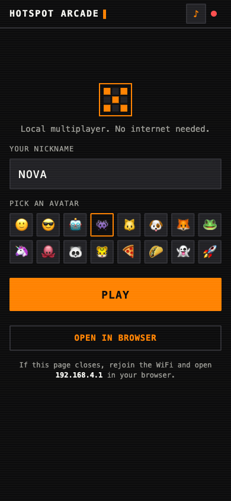
  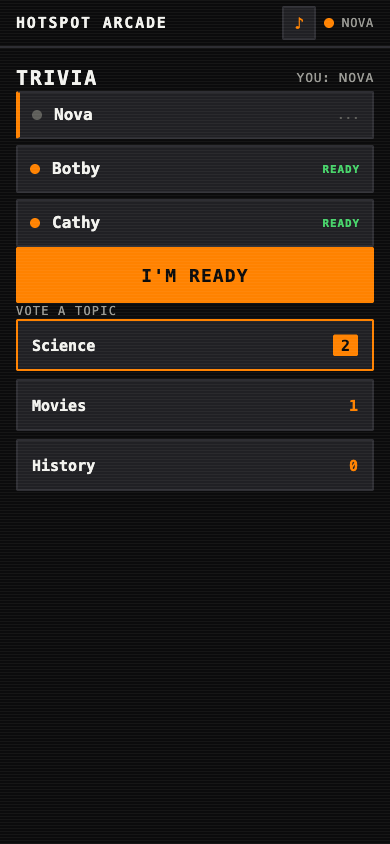
  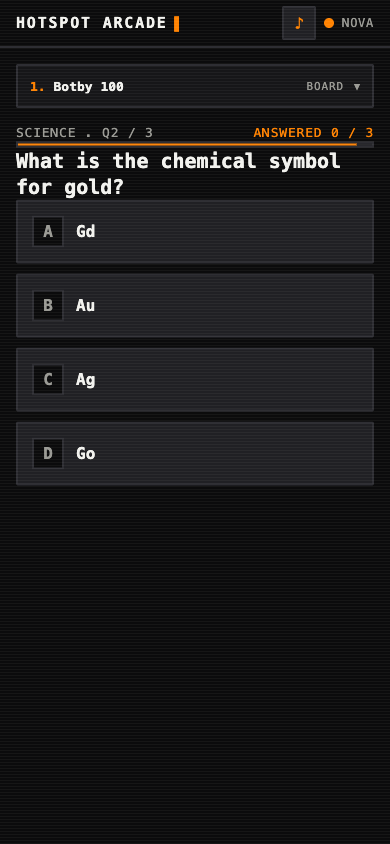
  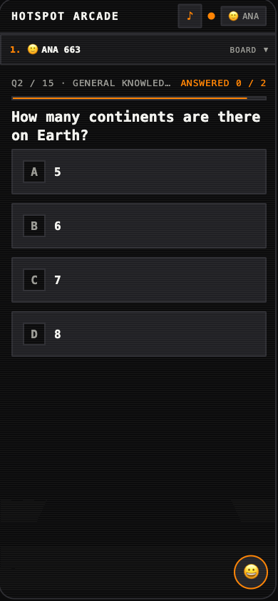
  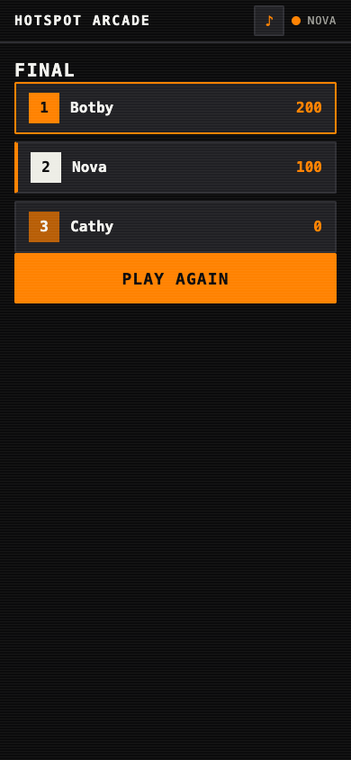
</p>

The whole-group party games (Would You Rather, Word Scramble, Reaction Duel) share the
ready-up lobby, countdown, and the collapsible live leaderboard:

<p align="center">
  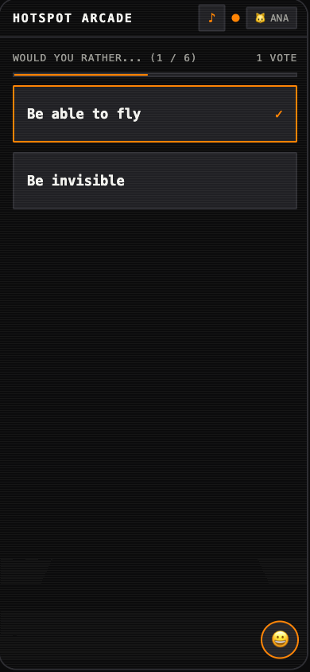
  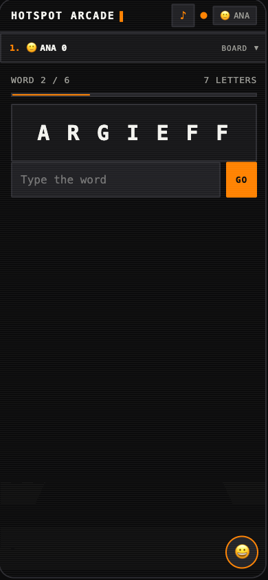
  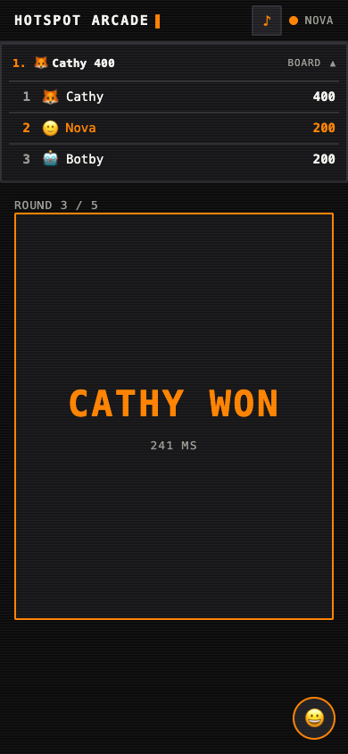
  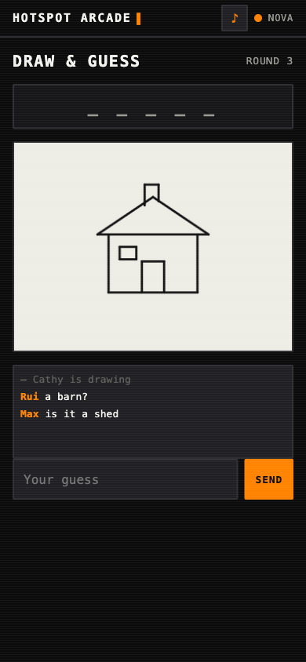
  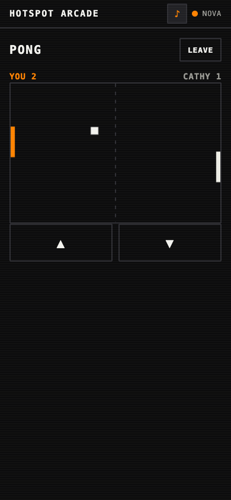
</p>

The 1v1 board duels (Connect Four, Tic-Tac-Toe, Dots &amp; Boxes, Reversi):

<p align="center">
  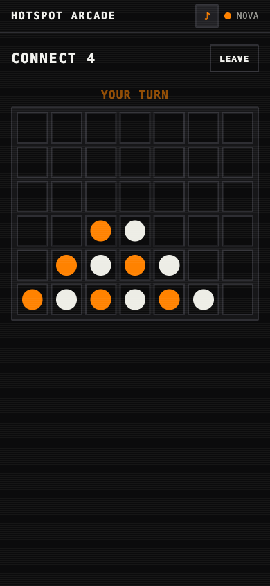
  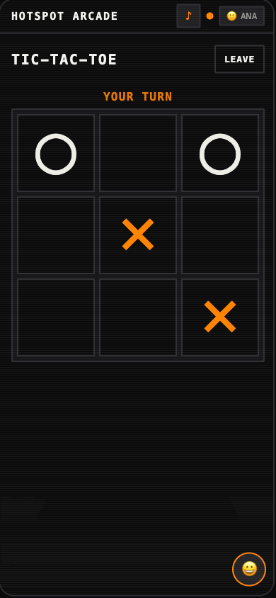
  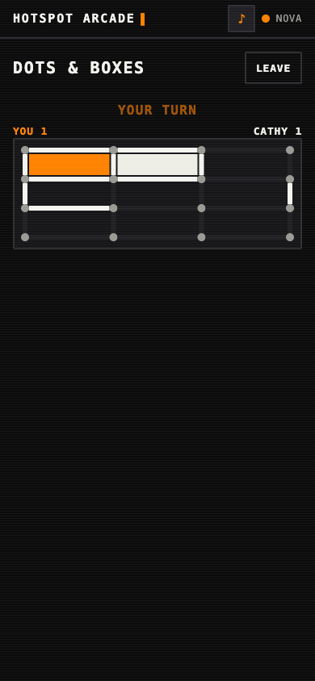
  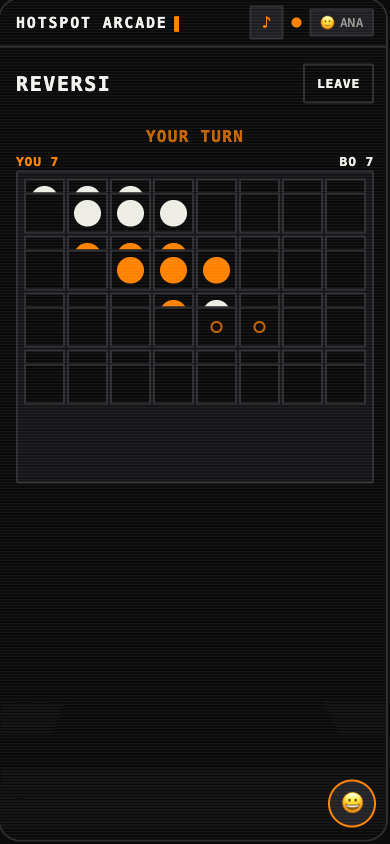
</p>

**On the Flipper** — the host device shows the app menu and the live broadcasting dashboard
(players + active game + event feed) on its 1-bit screen. Every game is phone-driven, so the
Flipper just selects the game and watches the feed:

<p align="center">
  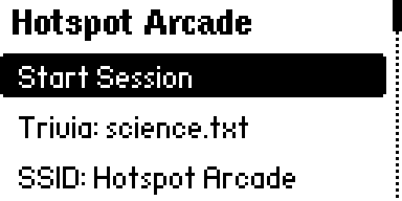
  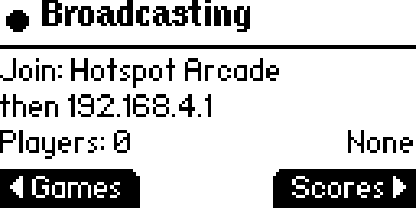
</p>

## Hardware

- **Flipper Zero** (developed on **Momentum** firmware; other forks work with a matching
  `ufbt` SDK).
- **Official Flipper WiFi Dev Board (ESP32-S2)** — mounts on the GPIO header, wiring the
  two together over UART.

## How it works

```
 Phones (browser)  <-- WebSocket -->  ESP32-S2  <-- UART 921600 -->  Flipper Zero
   play the game                     AP + web + referee              host / scoreboard
```

- The ESP hosts an **open AP + wildcard DNS + catch-all web server**, so joining the
  WiFi pops a captive page on every phone.
- The captive page hands off to the game web app at `http://192.168.4.1` (captive
  mini-browsers are too limited for WebSockets, so it is a "tap to open in your browser"
  handoff).
- The Flipper streams the (gzipped) web bundle and trivia content to the ESP over a
  framed UART protocol, then orchestrates rounds. Real-time game traffic stays on the
  ESP and never crosses the slow UART. Protocol: [docs/PROTOCOL.md](docs/PROTOCOL.md).

## Install & flash

Three parts: flash the ESP firmware, build+install the Flipper app, and put the web
bundle + trivia packs on the SD card. Full commands and gotchas are in
[CLAUDE.md](CLAUDE.md); the short version:

**1. Build the web bundle**
```sh
cd web && node build.mjs        # -> web/dist/{index.html.gz, manifest.json}
```

**2. ESP32-S2 firmware** (arduino-cli, esp32 core 2.0.17, vendored libs in `esp32/libs`)
```sh
arduino-cli compile --fqbn esp32:esp32:esp32s2:PartitionScheme=huge_app \
  --libraries esp32/libs --output-dir esp32/hotspot-arcade-fw/build esp32/hotspot-arcade-fw
# then esptool write-flash the four images (see CLAUDE.md; never --erase-all on the S2)
```
Or skip the computer entirely and **flash the ESP from the Flipper** (see below).

**3. Flipper app + SD content**
```sh
tools/build-fap.sh                         # -> dist/hotspot_arcade.fap (bundles the ESP firmware)
python3 tools/deploy-to-flipper.py --port /dev/cu.usbmodemflip_XXXX
```
`build-fap.sh` bundles the ESP firmware images into the fap (falls back to bare `ufbt`
if you don't need on-device flashing). The deploy script pushes the fap to
`/ext/apps/GPIO/`, the web bundle to `/ext/apps_data/hotspot_arcade/web/`, and the
trivia packs to `.../trivia/`.

### Flashing the ESP from the Flipper (no computer)

The app embeds Espressif's `esp-serial-flasher` **and bundles the ESP firmware inside the
.fap**, so a fresh install needs no SD setup: use **Install Firmware** in the main menu,
or accept the prompt the lobby shows when it does not see a board. Put the ESP in download
mode when asked (**hold BOOT, tap RESET, release BOOT**); it verifies with MD5 and reboots
into the new firmware. (The firmware ships via `fap_file_assets`, extracted to
`/ext/apps_assets/hotspot_arcade/firmware/` on launch.)

## Usage

On the Flipper: **Apps → GPIO → [ESP32] Hotspot Arcade**.

1. **Set the SSID** (optional). Trivia packs are picked up automatically from the SD card.
2. **Start Session** — the ESP brings up the AP; the dashboard shows **Broadcasting**.
3. People **join the WiFi** and open `192.168.4.1`, pick a nickname, and land in the lobby.
4. **Games** → pick a game. Everything is player-driven from the phones: the whole-group
   games (Trivia, Would You Rather, Word Scramble, Reaction Duel) self-run once players ready
   up; the duels (Connect Four / Tic-Tac-Toe / Dots & Boxes / Reversi), **Drawing**, and
   **Pong** organize themselves too. The dashboard **Feed** watches events.
5. **Leaderboard** shows live scores; **Console** shows the raw event log.

## Trivia packs

Simple text files under `trivia-packs/` (`Pack:` / `Q:` / `A:`-`D:` / `Answer:`, blocks
split by `---`). Drop your own into the SD `trivia/` folder. See
[trivia-packs/README.md](trivia-packs/README.md).

## Responsible use

Hotspot Arcade runs an **open** WiFi access point and a captive page that serves a game.
It is for fun and learning on your own hardware, among people who want to play. Running
an open AP may be restricted in some places (e.g. on aircraft, or where it could
interfere) — only operate it where that is allowed. It captures no credentials and
serves only the bundled game.

## Layout

```
flipper/hotspot-arcade/   Flipper app (C, ufbt/Momentum) — host + scoreboard
esp32/hotspot-arcade-fw/  ESP32-S2 firmware (Arduino) — AP + web + WebSocket referee
esp32/libs/               vendored AsyncTCP + ESPAsyncWebServer
web/                      phone game client (vanilla JS, gzipped bundle)
trivia-packs/             sample trivia content
tools/deploy-to-flipper.py
docs/                     ARCHITECTURE.md, PROTOCOL.md
```

Sibling project to flytrap, which this reuses the AP/captive-portal plumbing and
Flipper UART patterns from.
